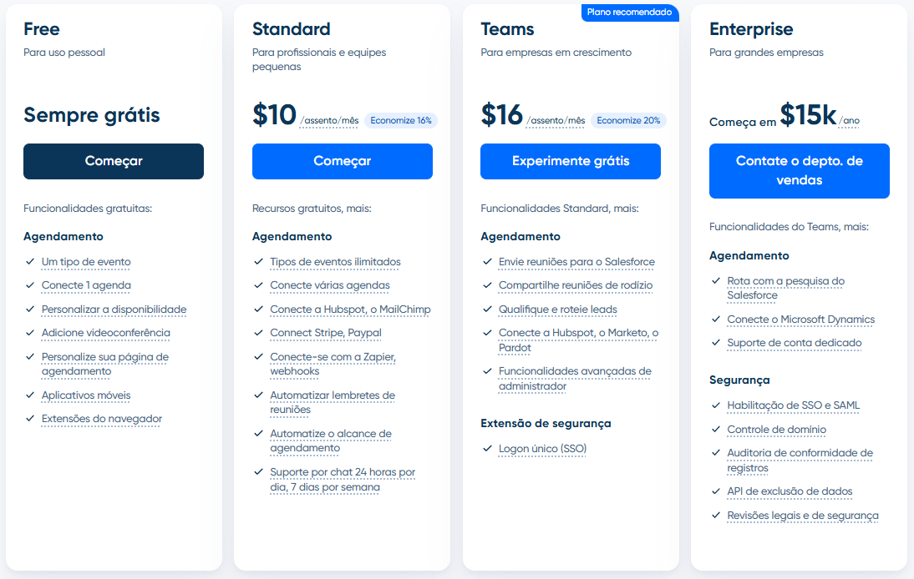

# ⚙️ Tecnologias - Gedui Site Institucional

## 🗓 Informações Gerais

- **Nome do Projeto:** Refatoração e Modernização do Site Institucional Gedui
- **Tech Lead:** Thiago Gomes
- **Data de Entrada na Área:** 04/11/2025
- **Data Estimada de Conclusão da Área:** 04/11/2025

## Checklist de Entrada e Saída da Área de Tecnologia

### ✅ Checklist de Entrada

- [✅] Documento de Visão de Produto validado
- [✅] Protótipos de alta fidelidade aprovados
- [✅] Materiais de identidade visual disponíveis

### 📤 Checklist de Saída

- [✅] Stack definida e aprovada
- [✅] Diagrama de arquitetura completo
- [✅] Plano de implantação claro
- [✅] Estrutura base de SEO implementada

---

## Stack Tecnológica

### Frontend

- **Framework:** Next.js 14 (Pages Router)
- **Linguagem principal:** TypeScript
- **Estratégia de renderização:** Static Site Generation (SSG)
- **Ferramentas adicionais:**
  - TailwindCSS para estilização
  - React Hook Form para formulários (contato, newsletter)
  - Axios para requisições HTTP
  - react-calendly para integração com sistema de agendamento
- **Justificativa da escolha:**
  - Next.js com SSG garante performance máxima e SEO otimizado para landing page
  - TypeScript previne erros e melhora manutenibilidade
  - TailwindCSS acelera desenvolvimento com utility-first approach
  - Pages Router oferece estrutura mais simples para site institucional

### Sistema de Agendamento

- **Plataforma:** Calendly (Plano Free)
- **Integração:** Widget embed e/ou Popup
- **Funcionalidades utilizadas:**

  - Um tipo de evento (demonstração de produto)
  - Conecta 1 agenda (Google Calendar)
  - Personalização da disponibilidade
  - Videoconferência integrada
  - Página de agendamento personalizada
  - Aplicativos móveis (gestão pela equipe Gedui)
  - Extensões do navegador

<p align="center">
 
</p>

**Nota sobre escolha do plano:** O plano Free atende perfeitamente às necessidades do projeto, oferecendo agendamento, remarcação, integração com Google Calendar e gestão centralizada pela conta da Gedui.

### Hospedagem e Deploy

- **Frontend:** AWS S3 + CloudFront (CDN)
- **Domínio e DNS:** Route 53 ou Cloudflare
- **SSL/TLS:** AWS Certificate Manager (ACM)

### Outras Tecnologias

- **Internacionalização:** next-i18next (suporte a PT-BR, EN, ES)
- **Validação de dados:** Zod (formulários de contato/newsletter)
- **Monitoramento:** CloudWatch Logs (apenas para Lambda@Edge se necessário)
- **Versionamento:** Git + GitHub
- **Analytics:** Google Analytics 4 ou similar

---

## Estrutura de Pastas e Arquivos

```
C:.
│   .env.example
│   .gitignore
│   eslint.config.mjs
│   next-env.d.ts
│   next.config.ts
│   package-lock.json
│   package.json
│   postcss.config.mjs
│   tsconfig.json
│
├───public
│       favicon.ico
│       apple-touch-icon.png
│       favicon-32x32.png
│       favicon-16x16.png
│       site.webmanifest
│       robots.txt
│       sitemap.xml
│       og-image.png              # Open Graph padrão
│       og-image-home.png         # OG específico da home
│       logo.png                  # Logo para Schema.org
│       file.svg
│       globe.svg
│       next.svg
│       vercel.svg
│       window.svg
│
└───src
    ├───components
    │   ├───common
    │   │       OrganizationSchema.tsx    # Schema.org da empresa
    │   │       SEO.tsx                   # Componente SEO reutilizável
    │   │       Header.tsx                # (a criar)
    │   │       Footer.tsx                # (a criar)
    │   │
    │   └───sections
    │           Hero.tsx                  # (a criar)
    │           Features.tsx              # (a criar)
    │           Testimonials.tsx          # (a criar)
    │           CTA.tsx                   # (a criar)
    │           BlogPreview.tsx           # (a criar)
    │
    ├───pages
    │   │   index.tsx                     # Homepage
    │   │   _app.tsx                      # App wrapper
    │   │   _document.tsx                 # Document config
    │   │   sobre.tsx                     # (a criar)
    │   │   contato.tsx                   # (a criar)
    │   │
    │   └───blog
    │           index.tsx                 # (a criar) Lista de posts
    │           [slug].tsx                # (a criar) Post individual
    │
    ├───styles
    │       globals.css
    │
    └───utils
            seo-helpers.ts                # (a criar) Helpers para SEO
```

---

## SEO: Estrutura Implementada

### 📋 O Que Foi Criado

#### 1. **Componente SEO.tsx** (`src/components/common/SEO.tsx`)

**Propósito:** Componente reutilizável para gerenciar todas as meta tags de SEO de forma centralizada e consistente.

**Funcionalidades implementadas:**

- Meta tags essenciais (title, description, keywords, author)
- Canonical URL (evita conteúdo duplicado)
- Open Graph para redes sociais (Facebook, LinkedIn, WhatsApp)
- Twitter Cards
- Suporte a artigos de blog (datas de publicação/modificação)
- Schema.org estruturado (WebPage/Article)
- Controle de indexação (noindex)

**Interface:**

```typescript
interface SEOProps {
  title: string; // Título da página
  description: string; // Descrição (150-160 caracteres)
  image?: string; // Imagem OG (1200x630px)
  type?: "website" | "article"; // Tipo de conteúdo
  noindex?: boolean; // Bloquear indexação
  keywords?: string; // Palavras-chave (separadas por vírgula)
  author?: string; // Autor do conteúdo
  publishedTime?: string; // Data de publicação (ISO)
  modifiedTime?: string; // Data de modificação (ISO)
}
```

#### 2. **Componente OrganizationSchema.tsx** (`src/components/common/OrganizationSchema.tsx`)

**Propósito:** Implementa Schema.org do tipo Organization para melhorar a compreensão dos motores de busca sobre a empresa.

**Dados estruturados incluídos:**

- Nome e URL da organização
- Logo oficial
- Descrição da empresa
- Endereço completo (País, Estado, Cidade)
- Ponto de contato (telefone, idiomas disponíveis)
- Perfis em redes sociais (LinkedIn, Twitter, Instagram)

**Por que é importante:**

- Melhora aparência nos resultados de busca (rich snippets)
- Aumenta credibilidade com Google Knowledge Graph
- Facilita integração com assistentes de voz

#### 3. **Configuração em \_document.tsx**

**Implementações:**

- Lang: `pt-BR` (define idioma principal)
- Preconnect para fontes e recursos externos (performance)
- Meta tags básicas de compatibilidade
- Favicons em múltiplos tamanhos
- Theme color para mobile
- Google Fonts (Inter) otimizado

#### 4. **Configuração em \_app.tsx**

- OrganizationSchema aplicado globalmente em todas as páginas
- Importação de estilos globais

#### 5. **Arquivos Estáticos em /public**

**Criados/requeridos:**

- `robots.txt` - Controle de crawlers
- `sitemap.xml` - Mapa do site para indexação
- Imagens Open Graph (`og-image.png`, `og-image-home.png`)
- Favicons em vários tamanhos
- `logo.png` - Para Schema.org

---

## 🎯 Instruções para o Time de Desenvolvimento

### 1. Criar Novas Páginas

Sempre que criar uma nova página, siga este template:

```typescript
import SEO from "@/components/common/SEO";

export default function NomeDaPagina() {
  return (
    <>
      <SEO
        title="Título da Página | Gedui"
        description="Descrição clara e concisa de 150-160 caracteres sobre o conteúdo desta página."
        keywords="palavra1, palavra2, palavra3"
        image="/og-image-nome-da-pagina.png"
      />

      <main>{/* Conteúdo da página */}</main>
    </>
  );
}
```

**Checklist ao criar página:**

- [ ] Componente `<SEO>` no topo
- [ ] Title único e descritivo (50-60 caracteres)
- [ ] Description persuasiva (150-160 caracteres)
- [ ] Keywords relevantes (3-5 principais)
- [ ] Imagem OG criada (1200x630px) e referenciada
- [ ] Testar preview com [opengraph.xyz](https://www.opengraph.xyz/)

### 2. Criar Posts de Blog

Para posts do blog, use o tipo `article` e inclua datas:

```typescript
import SEO from "@/components/common/SEO";

export default function BlogPost({ post }) {
  return (
    <>
      <SEO
        title={`${post.title} | Blog Gedui`}
        description={post.excerpt}
        keywords={post.tags.join(", ")}
        image={post.coverImage}
        type="article"
        author={post.author}
        publishedTime={post.publishedAt}
        modifiedTime={post.updatedAt}
      />

      <article>{/* Conteúdo do post */}</article>
    </>
  );
}
```

**Checklist para posts:**

- [ ] `type="article"` definido
- [ ] Datas ISO 8601 (`2025-01-15T10:30:00Z`)
- [ ] Autor especificado
- [ ] Tags convertidas em keywords
- [ ] Imagem de capa específica (mínimo 1200x630px)
- [ ] Excerpt como description

### 3. Atualizar robots.txt

Sempre que adicionar/remover seções importantes, atualize o `robots.txt`:

```txt
User-agent: *
Allow: /
Disallow: /admin/
Disallow: /api/

# Sitemap
Sitemap: https://gedui.com.br/sitemap.xml
```

**Regras importantes:**

- `Allow: /` - Permite tudo por padrão
- `Disallow: /admin/` - Bloqueia páginas administrativas
- `Disallow: /api/` - Bloqueia endpoints de API
- Sempre incluir URL do sitemap

### 4. Atualizar sitemap.xml

O sitemap deve ser regenerado sempre que novas páginas forem adicionadas. Use um script ou gerador automático.

**Estrutura básica:**

```xml
<?xml version="1.0" encoding="UTF-8"?>
<urlset xmlns="http://www.sitemaps.org/schemas/sitemap/0.9">
  <url>
    <loc>https://gedui.com.br/</loc>
    <lastmod>2025-11-24</lastmod>
    <changefreq>weekly</changefreq>
    <priority>1.0</priority>
  </url>
  <url>
    <loc>https://gedui.com.br/sobre</loc>
    <lastmod>2025-11-20</lastmod>
    <changefreq>monthly</changefreq>
    <priority>0.8</priority>
  </url>
  <!-- Adicione todas as páginas -->
</urlset>
```

**Prioridades sugeridas:**

- Homepage: `1.0`
- Páginas principais (sobre, recursos): `0.8`
- Posts de blog recentes: `0.6`
- Posts antigos: `0.4`

**Recomendação:** Implementar geração automática com `next-sitemap`.

### 5. Criar Imagens Open Graph

Todas as páginas importantes devem ter imagens OG personalizadas.

**Especificações:**

- **Dimensões:** 1200x630px (ratio 1.91:1)
- **Formato:** PNG ou JPG
- **Peso máximo:** 8MB (ideal: <300KB)
- **Design:** Logo, título da página, visual atrativo

**Ferramentas recomendadas:**

- Figma/Canva para criar
- TinyPNG para otimizar
- [opengraph.xyz](https://www.opengraph.xyz/) para testar

**Nomenclatura:**

```
/public/og-image.png              # Fallback padrão
/public/og-image-home.png         # Homepage
/public/og-image-sobre.png        # Página Sobre
/public/og-image-recursos.png     # Página Recursos
/public/og-image-blog-[slug].png  # Posts específicos (opcional)
```

### 6. Otimizar Performance e Core Web Vitals

**Imagens:**

- Use `<Image>` do Next.js sempre que possível
- Formatos modernos: WebP, AVIF
- Lazy loading automático
- Dimensions definidas (width/height)

**Fontes:**

- Preconnect configurado em `_document.tsx`
- `&display=swap` na URL do Google Fonts
- Considere hospedar localmente para melhor performance

**Scripts externos:**

- Async/defer quando possível
- Calendly carregado sob demanda
- Google Analytics com estratégia de carregamento otimizada

### 7. Monitoramento e Validação

**Ferramentas essenciais:**

1. **Google Search Console**

   - Enviar sitemap
   - Monitorar indexação
   - Verificar erros de rastreamento
   - Analisar performance de busca

2. **Validadores:**

   - [Schema.org Validator](https://validator.schema.org/)
   - [Rich Results Test](https://search.google.com/test/rich-results)
   - [Open Graph Debugger](https://www.opengraph.xyz/)
   - [PageSpeed Insights](https://pagespeed.web.dev/)

3. **Checklist antes do deploy:**
   - [ ] Validar Schema.org
   - [ ] Testar OG tags em simulador
   - [ ] Verificar robots.txt acessível
   - [ ] Verificar sitemap.xml válido
   - [ ] Canonical URLs corretos
   - [ ] Core Web Vitals verdes no Lighthouse
   - [ ] SSL/HTTPS ativo

### 8. Atualizações no OrganizationSchema.tsx

Quando houver mudanças na empresa, atualize:

```typescript
// Dados que podem precisar de atualização:
- telephone: "+55-11-XXXX-XXXX"  // Trocar pelo telefone real
- sameAs: []                      // Atualizar URLs de redes sociais
- address: {}                     // Confirmar endereço exato
```

**Quando atualizar:**

- Mudança de endereço
- Novo telefone de contato
- Novos perfis em redes sociais
- Alteração na descrição da empresa

### 9. Internacionalização e SEO

Quando implementar i18n (PT-BR, EN, ES):

```typescript
// Exemplo com hreflang
<link rel="alternate" hrefLang="pt-BR" href="https://gedui.com.br/" />
<link rel="alternate" hrefLang="en" href="https://gedui.com.br/en/" />
<link rel="alternate" hrefLang="es" href="https://gedui.com.br/es/" />
<link rel="alternate" hrefLang="x-default" href="https://gedui.com.br/" />
```

**Componente SEO expandido:**

```typescript
<SEO
  title={t("seo.home.title")}
  description={t("seo.home.description")}
  locale={router.locale} // Adicionar prop de locale
/>
```

---

## Arquitetura da Solução

### Visão Geral da Arquitetura

O projeto consiste em uma **landing page estática gerada com Next.js SSG** hospedada em S3/CloudFront para máxima performance, com **integração direta ao Calendly** para o sistema de agendamento de demonstrações.

**Componentes principais:**

- **Landing Page (Next.js SSG):** Páginas institucionais, blog e integração com Calendly
- **Calendly:** Sistema de agendamento completo (gerenciado externamente)
- **Google Calendar:** Calendário da equipe Gedui (integrado ao Calendly)

### Fluxo de Agendamento

**Cliente agendando demonstração:**

1. Cliente acessa landing page e clica em "Agendar Demonstração"
2. Widget/Popup do Calendly é carregado diretamente na página
3. Cliente visualiza horários disponíveis em tempo real
4. Cliente preenche dados e confirma agendamento no Calendly
5. Calendly automaticamente:
   - Adiciona evento ao Google Calendar da Gedui
   - Envia email de confirmação ao cliente
   - Envia notificação à equipe Gedui
   - Gera link de videoconferência
   - Permite remarcação/cancelamento pelo cliente

**Equipe Gedui gerenciando agendamentos:**

1. Acessa conta Calendly via web ou app móvel
2. Visualiza todos agendamentos em dashboard centralizado
3. Gerencia disponibilidade e configurações
4. Recebe notificações de novos agendamentos
5. Acessa eventos diretamente no Google Calendar

### Diagrama da Arquitetura

```
┌──────────────────────────────────────────────────────────────┐
│                         USUÁRIOS                              │
└───────────────────┬──────────────────────────────────────────┘
                    │
                    ▼
┌──────────────────────────────────────────────────────────────┐
│                 CloudFront CDN (HTTPS)                        │
│              • Cache global de assets                         │
│              • SSL/TLS automático (ACM)                       │
│              • Compressão GZIP/Brotli                         │
└────────┬─────────────────────────────────────────────────────┘
         │
         │ Landing Page
         ▼
┌─────────────────────────────────────────────────────────────┐
│              S3 Bucket (Next.js SSG)                         │
│                                                               │
│  • Páginas estáticas (Home, Sobre, Blog, etc)               │
│  • Assets otimizados (images, fonts, etc)                   │
│  • Integração com Calendly Widget                           │
│  • SEO otimizado (meta tags, Schema.org)                    │
└────────┬────────────────────────────────────────────────────┘
         │
         │ Embed/Popup Widget
         ▼
┌─────────────────────────────────────────────────────────────┐
│                    Calendly (SaaS)                           │
│                                                               │
│  • Sistema de agendamento completo                          │
│  • Gerenciamento de disponibilidade                         │
│  • Notificações por email                                   │
│  • Lembretes automáticos                                    │
│  • Página de agendamento personalizada                      │
│  • Dashboard de gestão                                      │
└────────┬───────────────────────────────────────┬────────────┘
         │                                       │
         │ Sincronização                        │ Videoconferência
         ▼                                       ▼
┌──────────────────────┐              ┌──────────────────────┐
│  Google Calendar     │              │  Google Meet /       │
│  (Conta Gedui)       │              │  Zoom / Teams        │
│                      │              │                      │
│  • Eventos sincroniza│              │  • Link automático   │
│  • Disponibilidade   │              │  • Gerado pelo       │
│  • Notificações      │              │    Calendly          │
└──────────────────────┘              └──────────────────────┘
```

### Integração com Calendly

**Métodos de Integração:**

**1. Widget Inline (Recomendado para página dedicada):**

```typescript
import { InlineWidget } from "react-calendly";

export default function AgendarDemo() {
  return (
    <InlineWidget
      url="https://calendly.com/gedui/demonstracao"
      styles={{ height: "700px" }}
      pageSettings={{
        backgroundColor: "ffffff",
        hideEventTypeDetails: false,
        hideLandingPageDetails: false,
        primaryColor: "00a2ff",
        textColor: "4d5055",
      }}
    />
  );
}
```

**2. Popup Widget (Recomendado para CTAs):**

```typescript
import { PopupWidget } from "react-calendly";

export default function CTAButton() {
  return (
    <PopupWidget
      url="https://calendly.com/gedui/demonstracao"
      rootElement={document.getElementById("root")}
      text="Agendar Demonstração"
      textColor="#ffffff"
      color="#00a2ff"
    />
  );
}
```

---

## Estrutura de Implantação

### Ambiente de Desenvolvimento

**Variáveis de ambiente principais:**

```bash
# .env.local (Frontend)
NEXT_PUBLIC_SITE_URL=http://localhost:3000
NEXT_PUBLIC_ENV=development
NEXT_PUBLIC_CALENDLY_URL=https://calendly.com/gedui/demonstracao

# Analytics (opcional em dev)
NEXT_PUBLIC_GA_TRACKING_ID=G-XXXXXXXXXX
```

**Setup local:**

```bash
npm install
npm run dev
# Acessa http://localhost:3000
```

### Ambiente de Produção

**URLs:**

- Landing Page: `https://gedui.com.br`
- Calendly: `https://calendly.com/gedui/demonstracao`

**Estratégia de deploy:**

- **Frontend (S3 + CloudFront):** Deploy automático via GitHub Actions ao merge na branch `main`
- **Build SSG:** `npm run build` gera páginas estáticas otimizadas
- **Invalidação de cache CloudFront automática após deploy**

**Infraestrutura AWS:**

- **Frontend:** S3 (bucket privado com policy de CloudFront) + CloudFront (distribuição pública)
- **DNS:** Route 53 ou Cloudflare
- **Certificados SSL:** ACM (AWS Certificate Manager)
- **Logs:** CloudWatch Logs (acesso CloudFront)
- **Monitoramento:** CloudWatch Metrics (requests, erros, latência)

---

## Considerações de Segurança

**Proteção de dados:**

- **Dados em trânsito:** HTTPS obrigatório (CloudFront + ACM)
- **Dados do Calendly:** Gerenciados pelo Calendly (compliance SOC 2, GDPR)
- **Privacidade:** Política de privacidade deve mencionar uso do Calendly

**Headers de Segurança (CloudFront):**

```
Content-Security-Policy: default-src 'self'; script-src 'self' 'unsafe-inline' https://assets.calendly.com; frame-src https://calendly.com;
X-Frame-Options: SAMEORIGIN
X-Content-Type-Options: nosniff
Referrer-Policy: strict-origin-when-cross-origin
Permissions-Policy: geolocation=(), microphone=(), camera=()
```

**Rate Limiting:**

- CloudFront com AWS WAF (opcional) para proteção contra DDoS
- Calendly possui proteção própria contra abuse

**Backup:**

- Código versionado no GitHub
- Assets críticos podem ter backup no S3 Glacier (opcional)
- Dados de agendamentos gerenciados pelo Calendly (backups automáticos)

---

## Custos Estimados

### Mensais (AWS):

- **S3:** ~$1-5 (armazenamento + requests)
- **CloudFront:** ~$5-20 (tráfego CDN, varia com volume)
- **Route 53:** ~$0.50 por hosted zone
- **ACM:** Gratuito

**Total estimado AWS:** $10-30/mês (tráfego baixo-médio)

### Calendly:

- **Plano Free:** $0/mês
- **Funcionalidades incluídas:** Agendamento ilimitado, 1 tipo de evento, integração Google Calendar, videoconferência, notificações

**Total geral estimado:** $10-30/mês

---

## Vantagens da Arquitetura Simplificada

**Redução de complexidade:**

- ✅ Eliminação de backend serverless (Lambda, API Gateway, DynamoDB)
- ✅ Sem necessidade de gerenciar autenticação (Cognito)
- ✅ Sem gestão de envio de emails (SES)
- ✅ Calendly gerencia todo fluxo de agendamento e notificações
- ✅ SEO otimizado desde o início (SSG + meta tags completas)

**Benefícios:**

- **Desenvolvimento mais rápido:** Foco apenas no frontend institucional
- **Menor custo operacional:** Infraestrutura mínima (S3 + CloudFront)
- **Manutenção simplificada:** Menos serviços para monitorar e atualizar
- **Confiabilidade:** Calendly é serviço especializado com 99.99% uptime
- **Experiência do usuário:** Interface testada e otimizada do Calendly
- **SEO de alta qualidade:** Estrutura completa implementada desde o início

**Trade-offs:**

- Dependência de serviço externo (Calendly)
- Menor customização da interface de agendamento
- Dados de agendamento armazenados no Calendly (vendor lock-in parcial)

---

## 📚 Recursos Adicionais

### Documentação Oficial

- [Next.js Documentation](https://nextjs.org/docs)
- [React Calendly](https://github.com/tcampb/react-calendly)
- [Schema.org](https://schema.org/)
- [Open Graph Protocol](https://ogp.me/)

### Ferramentas de SEO

- [Google Search Console](https://search.google.com/search-console)
- [Schema Markup Validator](https://validator.schema.org/)
- [Rich Results Test](https://search.google.com/test/rich-results)
- [Open Graph Debugger](https://www.opengraph.xyz/)
- [Lighthouse CI](https://github.com/GoogleChrome/lighthouse-ci)

### Performance

- [PageSpeed Insights](https://pagespeed.web.dev/)
- [Web Vitals](https://web.dev/vitals/)
- [TinyPNG](https://tinypng.com/) - Otimização de imagens

---

**Documentação atualizada em:** 24/11/2025  
**Versão:** 3.0 (Incluindo estrutura completa de SEO e instruções para o time)
