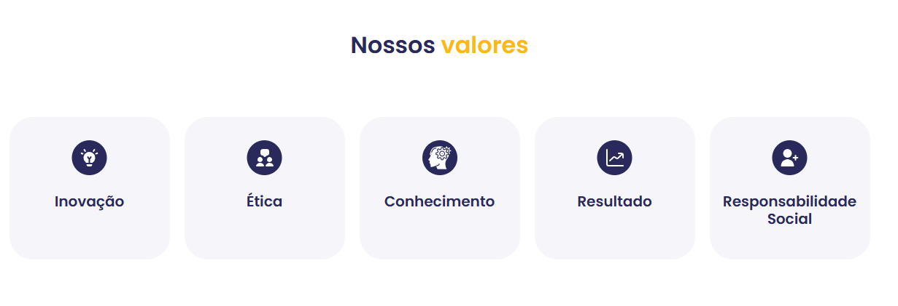
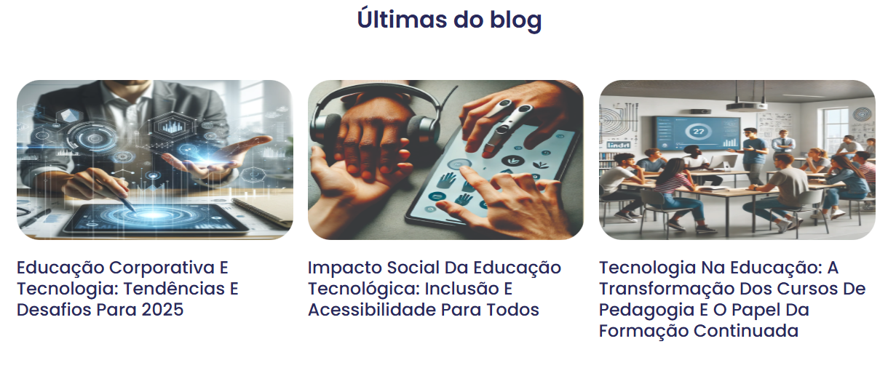
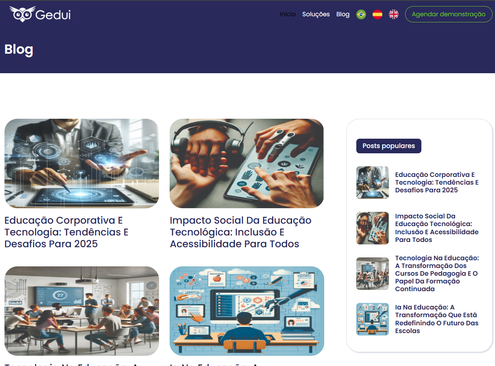
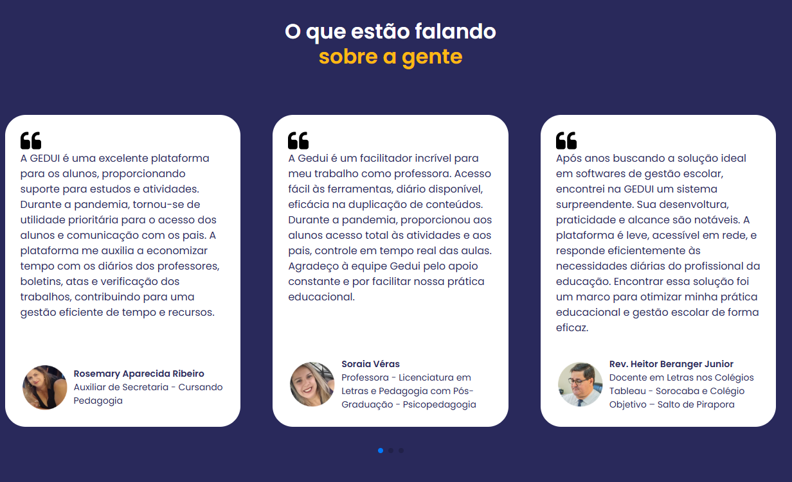
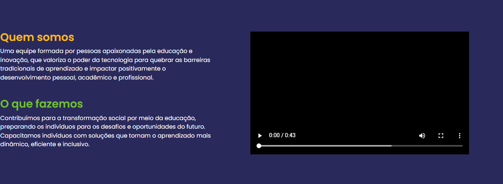
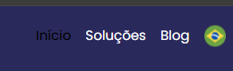

# 📄 Visão de Produto - Gedui Landing Page

## 🗓 Informações Gerais

- **Nome do Projeto:** Refatoração e Modernização do Site Institucional Gedui

- **Cliente:** Gedui - Ecossistema Educacional

- **Responsável da Visão de Produto (PO):** Thiago Gomes

- **Duração Total Estimada:** 5

- **Período na Etapa de Design (estimado):** 2

- **Período na Etapa de Desenvolvimento (estimado):** 3

---

## ✅ Checklist de Entrada (para iniciar o projeto)

- [✅] Reunião de Kickoff com o cliente realizada
- [✅] Análise do site atual (https://gedui.com.br/pt-br/) concluída
- [✅] Materiais de identidade visual recebidos e revisados
- [✅] Objetivo do projeto compreendido
- [✅] Tecnologias necessárias mapeadas (Next.js com SSG)
- [✅] Estimativa de esforço feita
- [✅] Capacidade do time verificada
- [✅] Escopo inicial aprovado pelo cliente

---

## 📤 Checklist de Saída (para encaminhar o projeto às próximas áreas)

- [✅] Documento de Visão preenchido e validado
- [✅] Matriz "é/não é/faz/não faz" definida
- [✅] Protótipos de alta fidelidade finalizados e aprovados pelo cliente
- [✅] Sistema de design baseado na nova identidade visual documentado
- [✅] Epics e User Stories redigidas
- [✅] Datas de entrada/saída em cada área definidas

---

## 📘 Resumo do Projeto

**Descrição:**

Refatoração completa do site institucional da Gedui, modernizando sua identidade visual, melhorando a experiência do usuário e implementando um sistema de agendamento de demonstrações integrado. O projeto envolve redesign das páginas existentes, manutenção dos blogs publicados e adição de funcionalidades de calendário para automatizar o processo de marcação de reuniões.

**Contexto:**

O site atual (https://gedui.com.br/pt-br/) possui visual datado e diversos problemas estéticos que prejudicam a percepção de qualidade da empresa. A Gedui já desenvolveu uma nova identidade visual (logos, paleta de cores e materiais institucionais) que deve ser aplicada ao site.

**Objetivos:**

- Modernizar completamente o visual do site alinhado à nova identidade visual da Gedui
- Melhorar significativamente a qualidade estética e experiência do usuário
- Implementar sistema de agendamento automatizado de demonstrações
- Manter e migrar o conteúdo de blogs existentes
- Garantir performance, SEO e responsividade em todos os dispositivos
- Criar um site que transmita profissionalismo e inovação tecnológica

**Público-Alvo:**

- **Corporativo (CORP):** Indústrias, prestadores de serviço, empresas, call centers, consultorias de RH
- **Educacional (EDU):** Escolas, universidades, cursos extracurriculares, redes de franquias, mentorias
- **Tomadores de decisão:** Gestores, diretores educacionais, responsáveis por RH/T&D

---

## 📦 Materiais Disponíveis

### Site Atual
- **URL:** https://gedui.com.br/pt-br/
- **Estrutura existente:** Páginas institucionais + sistema de blogs

### Materiais de Identidade Visual (recebidos)
- `Apres_Gedui_CORP.pdf` - Apresentação corporativa
- `Apres_Gedui_EDU.pdf` - Apresentação educacional
- `Apres_Institucional_nova.pdf` - Apresentação institucional
- `new_Logo-Gedui.pdf` - Nova logo (variações e paleta de cores)

**Localização dos assets no repositório:**
- Materiais de referência: `docs/docs/assets/`
- Imagens para documentação de problemas: `docs/docs/assets/problemas-observados/`

---

## 🎨 Diretrizes de Design

### Liberdade Criativa
O cliente autoriza **liberdade criativa** para:
- Ajustar fluxos de navegação se necessário
- Modificar textos quando fizer sentido
- Propor melhorias de UX/UI
- Reorganizar conteúdo para melhor experiência

**Importante:** Todas as alterações significativas devem ser apresentadas e aprovadas pelo cliente antes da implementação.

### Foco na Qualidade Estética
Este projeto **exige trabalho minucioso e cuidadoso** com design. A qualidade visual é prioridade máxima para transmitir profissionalismo e inovação tecnológica da Gedui.

---
Perfeito 👍 Entendi completamente.
Você quer uma versão revisada da seção **"Problemas Identificados no Site Atual"** do arquivo `visao-produto.md`, incluindo:

* As **imagens** correspondentes a cada problema (usando links Markdown corretos com base na estrutura de pastas).
* **Comentários objetivos e descritivos** sobre cada imagem.
* Um **tom explicativo e analítico**, deixando claro que os exemplos são **amostras observadas** e **não uma lista exaustiva**.

Aqui está o texto reescrito conforme suas instruções:

---

## ⚠️ Problemas Identificados no Site Atual

> **Nota:** Esta seção apresenta exemplos de problemas estéticos e de experiência do usuário (UX) observados no site atual.
> Os casos abaixo ilustram **alguns dos motivos que tornam a interface datada e justificam uma refatoração completa**.
> As imagens correspondentes estão em `docs/docs/assets/problemas-observados/`.

A análise evidencia deficiências visuais e de usabilidade que impactam a atratividade e a modernidade do site. Embora não abranja todos os pontos existentes, a amostragem a seguir destaca aspectos representativos que precisam ser repensados.

---

### 1. Simplicidade Excessiva e Falta de Hierarquia Visual

A seção “Nossos Valores” exemplifica a falta de hierarquia e de profundidade no design. Ícones genéricos e caixas simples resultam em uma apresentação plana, sem destaque visual para os elementos principais.
O conteúdo parece básico e pouco envolvente, dificultando a leitura dinâmica e reduzindo o impacto da mensagem institucional.

---

### 2. Uso de Imagens Genéricas (Stock Photos)

Muitas imagens utilizadas (como nas postagens do blog) são de bancos de imagem genéricos, sem conexão real com a marca ou seu público.
Esse uso excessivo de *stock photos* transmite impessoalidade e enfraquece a autenticidade da comunicação visual.

---

### 3. Layout e Disposição de Elementos

A composição da página apresenta espaçamentos desequilibrados, alinhamentos inconsistentes e uma grade pouco coesa.
O resultado é uma estética ultrapassada, que compromete a leitura e a experiência geral do usuário, especialmente em seções como o Blog.

---

### 4. Falta de Interatividade e Feedback ao Usuário

O carrossel de depoimentos é estático e exige interação manual. Essa falta de movimento automático reduz o dinamismo da página e prejudica o engajamento.
Além disso, vídeos institucionais aparecem como blocos pretos sem *autoplay* nem botões de *play* evidentes, o que cria uma barreira desnecessária para o usuário.

Esses comportamentos reforçam a percepção de um site pouco interativo e desatualizado.

---

### 5. Baixo Contraste e Problemas de Acessibilidade (WCAG)

O menu principal apresenta texto com baixo contraste sobre um fundo escuro, violando recomendações básicas de acessibilidade (WCAG).
Isso dificulta a leitura até mesmo para usuários sem limitações visuais e evidencia a necessidade de revisar as cores e o design de interface com foco em acessibilidade.

---

**Em resumo**, os exemplos apresentados demonstram que o site carece de modernidade visual, hierarquia informacional, interatividade e conformidade com padrões de acessibilidade.
Esses pontos, embora apenas uma amostra, já justificam **uma refatoração completa da interface e da experiência do usuário**.

---

Quer que eu também adicione um subtítulo final com “Próximos Passos” ou “Recomendações de Melhoria” para fechar a seção? Isso deixaria o documento mais completo e estratégico.

## 👤 Personas

**Gestor Corporativo de T&D**
- Busca soluções de capacitação para equipes
- Precisa de informações claras sobre ROI e funcionalidades
- Valoriza profissionalismo e tecnologia moderna

**Diretor Educacional**
- Responsável por escolher plataformas educacionais
- Avalia recursos pedagógicos e infraestrutura técnica
- Precisa entender casos de uso e diferenciais

**Consultor/Decisor de RH**
- Avalia plataformas para clientes
- Analisa escalabilidade e customização
- Busca informações técnicas e cases

---

## 🧩 Matriz "É / Não É / Faz / Não Faz"

| Categoria  | Descrição |
|-----------|-----------|
| **É** | Um site institucional moderno e responsivo com landing pages, blog e sistema de agendamento; Uma refatoração visual completa aplicando nova identidade; Uma experiência web otimizada para conversão e SEO |
| **Não É** | Um aplicativo nativo mobile; Uma plataforma educacional (isso é o produto da Gedui); Um redesign da plataforma interna da Gedui |
| **Faz** | Apresenta produtos e serviços Gedui CORP e EDU; Permite agendamento automatizado de demonstrações; Exibe e gerencia blog posts; Envia notificações por email sobre agendamentos; Oferece painel administrativo de gestão de agenda |
| **Não Faz** | Integração com a plataforma educacional interna da Gedui; Pagamentos ou e-commerce; Autenticação de usuários finais (exceto admin); Gestão de conteúdo educacional |

---

## 🧠 Matriz de Certezas, Suposições e Dúvidas

| Tipo        | Descrição |
|-------------|-----------|
| **Certeza** | O site deve seguir a nova identidade visual fornecida (logos e paleta) |
| **Certeza** | Deve existir sistema de agendamento automatizado de demonstrações |
| **Certeza** | O conteúdo dos blogs existentes deve ser mantido |
| **Certeza** | Notificações por email devem ser enviadas em agendamentos e alterações |
| **Certeza** | Deve haver painel administrativo para gestão da agenda |
| **Certeza** | O site deve manter suporte multilíngue (PT-BR, EN, ES) |
| **Certeza** | O site atual possui boas práticas de acessibilidade que devem ser mantidas e aprimoradas |
| **Suposição** | O site será construído com Next.js utilizando SSG para otimização de SEO |
| **Suposição** | A maioria dos acessos virá de desktop (B2B), mas mobile é importante |
| **Suposição** | O cliente valoriza animações e interatividade moderna |
| **Dúvida** | Qual a estrutura exata dos dados de blog? (CMS? Markdown? Banco de dados?) |
| **Dúvida** | Existem integrações de calendário necessárias? (Google Calendar, Outlook?) |
| **Dúvida** | Há necessidade de formulários adicionais além do agendamento? |
| **Dúvida** | Existe analytics/tracking específico que deve ser implementado? |

---

## 🧱 Epics e User Stories

### 🔹 Epics

- **Epic 1:** Redesign Visual e Identidade
- **Epic 2:** Sistema de Agendamento (Frontend)
- **Epic 3:** Painel Administrativo de Agendamentos
- **Epic 4:** Migração e Gestão de Blog
- **Epic 5:** Otimização e Performance (SEO, responsividade)

---

### 🔸 User Stories

#### **Epic 1: Redesign Visual e Identidade**

**US1.1 - Aplicação da Nova Identidade Visual**
- **Usuário:** Como visitante do site
- **Objetivo:** Quero ver um site moderno e profissional com a nova identidade da Gedui
- **Justificativa:** Para ter confiança na empresa e seus produtos tecnológicos

**US1.2 - Navegação Intuitiva**
- **Usuário:** Como potencial cliente
- **Objetivo:** Quero navegar facilmente entre as seções CORP e EDU
- **Justificativa:** Para encontrar rapidamente as informações relevantes ao meu segmento

**US1.3 - Experiência Visual Rica**
- **Usuário:** Como visitante
- **Objetivo:** Quero ver animações suaves, transições e elementos interativos
- **Justificativa:** Para ter uma experiência moderna e engajadora

---

#### **Epic 2: Sistema de Agendamento (Frontend)**

**US2.1 - Visualização de Disponibilidade**
- **Usuário:** Como potencial cliente
- **Objetivo:** Quero visualizar os horários disponíveis para demonstração
- **Justificativa:** Para escolher o melhor momento para conhecer a plataforma

**US2.2 - Agendamento de Demonstração**
- **Usuário:** Como potencial cliente
- **Objetivo:** Quero agendar uma demonstração selecionando data e horário disponível
- **Justificativa:** Para conhecer a plataforma Gedui sem processos manuais

**US2.3 - Confirmação de Agendamento**
- **Usuário:** Como potencial cliente
- **Objetivo:** Quero receber confirmação por email do meu agendamento
- **Justificativa:** Para ter registro e lembrete da demonstração marcada

---

#### **Epic 3: Painel Administrativo de Agendamentos**

**US3.1 - Visualização de Agendamentos**
- **Usuário:** Como administrador Gedui
- **Objetivo:** Quero ver todos os agendamentos de forma organizada (calendário/lista)
- **Justificativa:** Para gerenciar minha agenda de demonstrações

**US3.2 - Gestão de Agendamentos**
- **Usuário:** Como administrador Gedui
- **Objetivo:** Quero poder remarcar, cancelar ou editar agendamentos
- **Justificativa:** Para lidar com imprevistos e reorganizar minha agenda

**US3.3 - Notificações ao Cliente**
- **Usuário:** Como administrador Gedui
- **Objetivo:** Quero que o cliente receba email automático quando eu alterar um agendamento
- **Justificativa:** Para manter o cliente informado sobre mudanças

**US3.4 - Informações do Lead**
- **Usuário:** Como administrador Gedui
- **Objetivo:** Quero visualizar nome, contato e observações do cliente que agendou
- **Justificativa:** Para me preparar adequadamente para a demonstração

---

#### **Epic 4: Migração e Gestão de Blog**

**US4.1 - Leitura de Posts**
- **Usuário:** Como visitante interessado
- **Objetivo:** Quero ler os posts do blog com boa legibilidade
- **Justificativa:** Para me informar sobre educação corporativa e novidades da Gedui

**US4.2 - Navegação no Blog**
- **Usuário:** Como leitor do blog
- **Objetivo:** Quero filtrar/buscar posts por categoria ou tema
- **Justificativa:** Para encontrar conteúdo relevante aos meus interesses

---

#### **Epic 5: Otimização e Performance**

**US5.1 - Acesso Mobile**
- **Usuário:** Como visitante mobile
- **Objetivo:** Quero navegar no site confortavelmente no celular/tablet
- **Justificativa:** Para acessar informações em qualquer dispositivo

**US5.2 - Carregamento Rápido**
- **Usuário:** Como qualquer visitante
- **Objetivo:** Quero que o site carregue rapidamente
- **Justificativa:** Para não perder tempo e ter boa experiência

---

## ⚙️ Requisitos Funcionais

### Requisitos de Design e Frontend

**RF01** - O site deve implementar a nova identidade visual da Gedui com logos, cores e tipografia fornecidas nos materiais

**RF02** - Todos os elementos interativos (botões, links, cards) devem possuir estados de hover, active e focus com animações suaves

**RF03** - O design deve utilizar a paleta de cores de forma rica, incluindo gradientes, overlays e variações tonais

**RF04** - Imagens e ilustrações devem ser personalizadas e alinhadas com a identidade Gedui, evitando stock photos genéricas

**RF05** - A interface deve incluir micro-animações e transições para melhorar feedback visual e engajamento

**RF06** - O site deve apresentar hierarquia visual clara através de tipografia, espaçamento e contraste

---

### Requisitos de Agendamento (Frontend)

**RF07** - O sistema deve exibir um calendário interativo mostrando dias e horários disponíveis para demonstração

**RF08** - O usuário deve poder selecionar data e horário disponível e preencher formulário com: nome, email, telefone, empresa e observações (opcional)

**RF09** - Após agendamento bem-sucedido, o sistema deve exibir confirmação visual e enviar email automático ao cliente

**RF10** - O email de confirmação deve conter: data, horário, informações de contato Gedui e opção de cancelamento

**RF11** - O sistema deve validar conflitos de horário e não permitir agendamentos duplicados

**RF12** - O sistema deve enviar notificação por email para a Gedui quando novo agendamento for criado

---

### Requisitos de Painel Administrativo

**RF13** - O painel admin deve requerer autenticação para acesso

**RF14** - O admin deve visualizar todos os agendamentos em formato de calendário e lista

**RF15** - O admin deve poder filtrar agendamentos por data, status (confirmado/cancelado) e cliente

**RF16** - O admin deve poder editar horário de agendamento, com envio automático de email ao cliente

**RF17** - O admin deve poder cancelar agendamentos, com envio automático de email ao cliente

**RF18** - O admin deve visualizar dados completos do lead: nome, email, telefone, empresa e observações

**RF19** - O admin deve poder marcar agendamentos como "realizado" ou adicionar notas pós-demonstração

---

### Requisitos de Blog

**RF20** - O site deve migrar e exibir todos os posts de blog existentes mantendo URLs ou implementando redirects

**RF21** - Posts devem ter layout otimizado para leitura com tipografia adequada e espaçamento generoso

**RF22** - O blog deve ter página de listagem com cards de preview (imagem, título, excerpt, data)

**RF23** - Deve existir sistema de categorias/tags para organização de conteúdo

**RF24** - Posts devem incluir CTA para agendamento de demonstração

---

### Requisitos Técnicos e Performance

**RF25** - O site deve ser construído utilizando Next.js com Static Site Generation (SSG) para otimização de SEO

**RF26** - Todas as páginas devem utilizar tags HTML semânticas (header, nav, main, article, section, footer)

**RF27** - O site deve implementar estratégia de assets leves: imagens otimizadas (WebP/AVIF), lazy loading, compressão

**RF28** - O site deve incluir arquivo robots.txt configurado corretamente para SEO

**RF29** - Todas as páginas devem ter meta tags apropriadas: title, description, og:tags, canonical

**RF30** - O site deve ter sitemap.xml gerado automaticamente

**RF31** - O site deve implementar schema markup (JSON-LD) para rich snippets

**RF32** - O site deve alcançar score Lighthouse: Performance >90, Accessibility >95, Best Practices >95, SEO 100

**RF33** - Imagens devem usar formatos modernos com fallbacks e atributos alt descritivos

---

## 🔒 Requisitos Não-Funcionais (RNF)

### Internacionalização e Localização

**RNF01** - O site deve oferecer suporte multilíngue completo para três idiomas: Português Brasileiro (PT-BR), Inglês (EN) e Espanhol (ES)

**RNF02** - A troca de idioma deve ser intuitiva, com seletor visível no header, mantendo o padrão atual de bandeiras

**RNF03** - Todo o conteúdo deve ser traduzido, incluindo: interface, páginas institucionais, formulários, mensagens de erro e emails de notificação

**RNF04** - URLs devem seguir padrão de internacionalização (ex: `/pt-br/`, `/en/`, `/es/`)

---

### Acessibilidade (A11y)

**RNF07** - O site deve manter e aprimorar as boas práticas de acessibilidade já existentes no site atual

**RNF09** - Todo conteúdo não-textual deve ter alternativas textuais (alt text descritivos e contextuais)

**RNF10** - Navegação completa por teclado com ordem lógica de foco e indicadores visuais claros

**RNF11** - Contraste de cores adequado em todos os elementos (mínimo 4.5:1 para texto normal, 3:1 para texto grande)

**RNF12** - Suporte a leitores de tela com uso apropriado de ARIA labels e roles

**RNF13** - Formulários devem ter labels associados, mensagens de erro claras e instruções acessíveis

---

### Compatibilidade

**RNF22** - Responsividade total testada em dispositivos reais: smartphones, tablets e desktops

---

### Segurança

**RNF24** - Comunicação via HTTPS obrigatório em todo o site

**RNF25** - Proteção contra XSS, CSRF e SQL Injection

**RNF26** - Painel administrativo com autenticação segura (OAuth 2.0 ou JWT)

**RNF27** - Rate limiting em formulários e APIs para prevenir spam e ataques

**RNF28** - Dados de usuários (agendamentos) devem seguir LGPD, com política de privacidade clara

---

## 📱 Responsividade

**O projeto será responsivo?**
- [x] Sim

**Abrangência de responsividade:**
- [x] Totalmente responsivo (desktop, tablet, mobile)
- [x] Mobile-first approach
- [x] Adaptável para tablets
- [x] Otimizado para desktops grandes e notebooks

---

## 🎯 Principais Diferenciais do Redesign

O redesign deve transmitir:
- **Inovação tecnológica** através de design moderno e interativo
- **Profissionalismo** com hierarquia clara e conteúdo bem estruturado
- **Confiabilidade** através de design consistente e polido
- **Acessibilidade** facilitando conversão e contato
- **Alcance global** com suporte multilíngue robusto (PT-BR, EN, ES)

### ✨ Pontos Fortes Atuais a Manter

O site atual possui qualidades que devem ser preservadas e aprimoradas:
- **Acessibilidade:** Boas práticas de a11y já implementadas
- **Multilinguismo:** Suporte bem estruturado para PT-BR, EN e ES
- **Estrutura de conteúdo:** Organização lógica das informações

---

## 📌 Observações Finais

### Dependências Externas
- Servidor de email para envio de notificações (a definir com desenvolvimento)
- Possível integração com calendário externo (Google Calendar/Outlook) - **validar com cliente**

### Processo de Aprovação
- Todos os protótipos de alta fidelidade devem ser apresentados e aprovados pelo cliente antes do desenvolvimento

### Próximos Passos
1. Validar dúvidas da matriz com o cliente
2. Criar protótipos de alta fidelidade
3. Apresentar para aprovação do cliente
4. Passar para desenvolvimento
